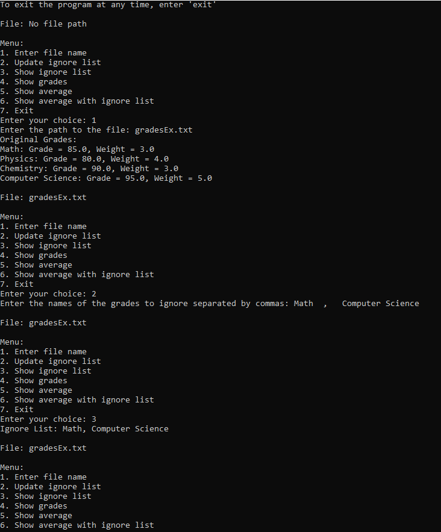
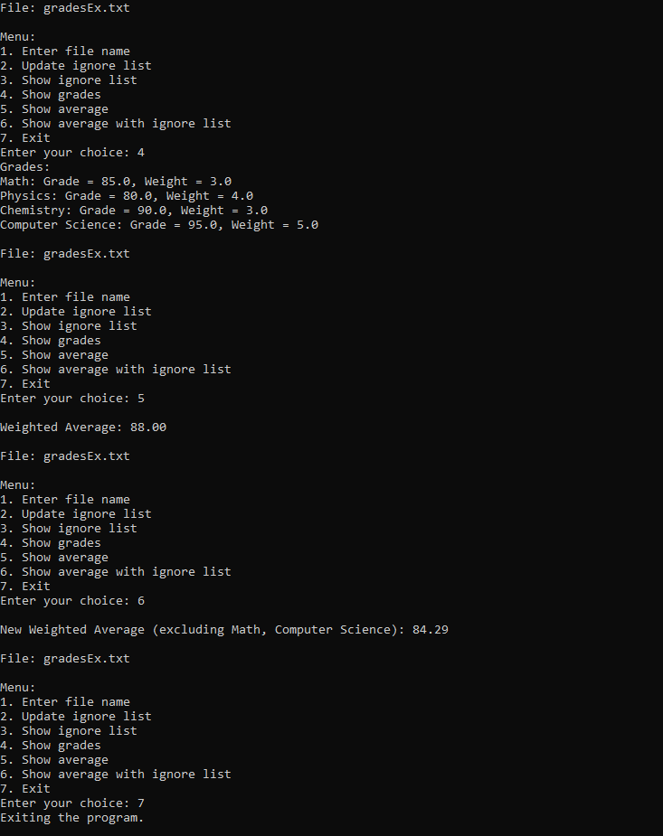

# University-Average-Grades

A Python script that manages and calculates weighted averages of grades using a menu-driven interface.

## Features
- Enter a file name to read grades from a file.
- Update the list of grades to ignore in calculations.
- Show the list of grades.
- Show the list of ignored grades.
- Calculate and display the weighted average of grades.
- Calculate and display the weighted average of grades excluding the ignored grades.

## Example Usage

Make sure that your grades are in a text file with the following format: `[name of the course]:[grade]:[weight]`

### Grades Text File Example

Math:85:3
Physics:80:4
Chemistry:90:3
Computer Science:95:5

### Example

